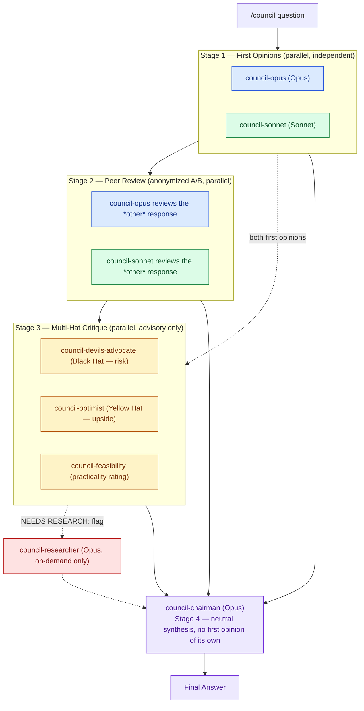

# LLM Council — Agent Architecture

Generated to accompany `.claude/agents/` and `.claude/skills/council/SKILL.md`. See `CLAUDE.md` for the full rationale.

## Roster reference

| Agent | Model | Role | Sees other members' output? |
|---|---|---|---|
| `council-opus` | Opus | Stage 1 first opinion, Stage 2 peer review | No (Stage 1), one anonymized peer response (Stage 2) |
| `council-sonnet` | Sonnet | Stage 1 first opinion, Stage 2 peer review | No (Stage 1), one anonymized peer response (Stage 2) |
| `council-devils-advocate` | Sonnet | Stage 3 — Black Hat, risk/weakness case (advisory) | Both Stage 1 answers only |
| `council-optimist` | Sonnet | Stage 3 — Yellow Hat, upside case (advisory) | Both Stage 1 answers only |
| `council-feasibility` | Sonnet | Stage 3 — practicality rating (advisory) | Both Stage 1 answers only |
| `council-researcher` | Opus | On-demand only — dispatched on `NEEDS RESEARCH:` flags | The specific flagged question only |
| `council-chairman` | Opus | Stage 4 — neutral synthesis, never gives a first opinion | Everything, in randomized order |

## Why it's shaped this way

- **Independence in Stage 1**: `council-opus` and `council-sonnet` never see each other's answer before writing their own — avoids anchoring.
- **Anonymization in Stage 2**: peer review is done on Response A/B, letter assignment randomized per run, so critique isn't colored by which model wrote which answer.
- **Advisory-only hats in Stage 3**: Devil's Advocate, Optimist, and Feasibility rate and flag but never veto — this is modeled on de Bono's Six Thinking Hats, keeping risk/upside/practicality judgments separate rather than blended into one model's single response.
- **Research is on-demand, not standing**: `council-researcher` only runs when something explicitly flags `NEEDS RESEARCH:` — it's never dispatched speculatively.
- **Chairman is a dedicated, opinion-free role**: splitting synthesis out from `council-opus` was a deliberate fix so the final answer isn't biased toward whichever model wrote the chairman prompt; inputs are assembled in randomized order so it can't anchor on read-order either.
